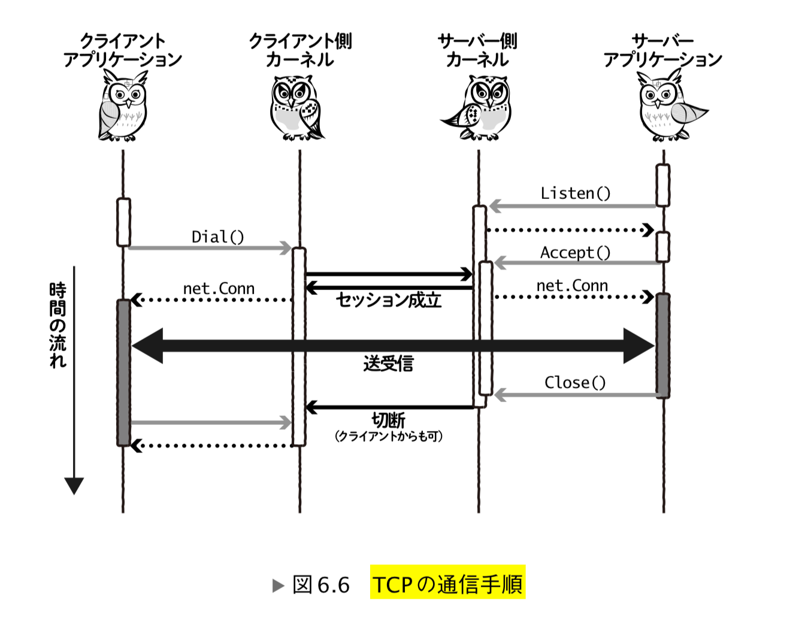

2019-12-30 02:43:52

# go-httpd
golang で httpd を作成してみた話
**いかにして私は RFC7230 を読むに至ったのか**

cf. https://ascii.jp/elem/000/001/276/1276572/

httpd(webサーバ) を golang かつ TCPの機能を使って作ってみる
(echo サーバじゃなくて http サーバを作ってみる)

golang で httpd を作成するときは普通は高機能な net/http以下のAPI(アプリケーション層のプロトコルをしゃべるAPI)を使うことが多いが、
どうやってwebサーバが実現されているかを知るために自分でhttpdを作ってみるのが良さそう。ソケット通信を直接扱う低レイヤーなnetのAPI(トランスポート層のTCPなどをしゃべるAPI)を使って作ってみる。

net/http APIもその下の net API を使ってhttp通信を実現している。

## HTTP
- cf. [HTTP入門](http://www.tohoho-web.com/ex/http.htm)

- HTTP メッセージ
  - リクエスト
  - レスポンス

HTTP メッセージを BNF で書くとこんな感じ

- `* ( hoge )` 0回以上()内のhogeの繰り返しを表す
- `[ hoge ]` 0回か1回の []内のhogeを表す

```
HTTP-Message = start-line
               *( header-field CRLF)
               CRLF
               [ message-body ]

start-line = request-line / status-line
```

cf. https://triple-underscore.github.io/RFC7230-ja.html#section-3

### リクエスト
ex.
`-- hoge` は、その行が何を表しているかを示している。

```
GET / HTTP/1.1 -- リクエスト行
Host: www.google.co.jp -- ヘッダ
User-Agent: curl/7.67.0 -- ヘッダ
Accept: */* -- ヘッダ
-- 空行(ヘッダとメッセージボディを区別するためにこれが必要)
-- メッセージボディ(POSTメソッドなどで使用する)
```

### レスポンス
ex.

```
HTTP/1.1 200 OK -- レスポンス行
Connection: close -- ヘッダ
Content-Type: application/json; charset=utf-8 -- ヘッダ
Date: Sun, 05 Jan 2020 15:57:44 GMT -- ヘッダ
Content-Length: 177 -- ヘッダ
-- 空行(ヘッダとメッセージボディを区別するためにこれが必要)
{"msg": "ok"} -- メッセージボディ
```

### curl で生のHTTPメッセージを見てみる


``` shell
# レスポンスヘッダの確認
curl -I(--head) https://www.google.co.jp/
# レスポンス/リクエストメッセージなどの詳細の確認
curl -v https://www.google.co.jp/
```

### 閑話休題：HTTP のバージョンごとの違い
HTTP 0.9 (HTTP1.0より以前の通信プロトコルバージョンを便宜上0.9と呼ぶ)

- HTML の取得を行うのみ(1.1でいうところのメソッドやヘッダが無くて、ボディメッセージのみでやり取りを行う)

HTTP 1.0

- HTTPメッセージの構文が整備された
- ヘッダが追加された
- HTTPバージョンが追加された
- リクエスト時にメソッドが送信できるようになった(GET,PUT,POST,DELETE...)
- レスポンス時にステータスコードが送れるようになった(200,400,500,...)

HTTP 1.1

- 通信の高速化(Keep-Aliveの追加)
- プロトコルのアップグレードが可能に(HTTP -> HTTPS, WebSocket, HTTP/2など)
- チャンクエンコーディングサポート

2020-01-06 時点では 1.1 が一番良く使われているバージョンと思われる。

HTTP 2.0

- 1.1 から HTTP メッセージの基本文法には変化なし
- メッセージの送受信がテキストベースからバイナリベースに
- ストリームを用いたデータの送受信
- サーバープッシュ
- ヘッダの圧縮

cf. [HTTPのバージョンについてまとめ - Qiita](https://qiita.com/hirooka0527/items/13767855358f83db5e02)

### 閑話休題 curl について

以下のような http サーバに対して、 curl で叩くとこんな感じのエラーが出る。
curl はサーバ側で close(2) する前に read(2) しないといけないようになってるっぽい

RFC 7230 (HTTP/1.1 の仕様) を読むと以下のようにある

> client: close を 送る
> server: close を 読み取る
> server: close を 送る
> client: close を 読み取る
>
> server 側がデータを全て読み取ってない状態で close すると、 RSTパケットがClientに送られてしまい、connection refused エラーが発生する


``` shell
X / _ /) < curl localhost:8080
Hello World
curl: (56) Recv failure: Connection reset by peer
```

http server

``` go
package main

import "net"

func main() {
	tcpAddr, err := net.ResolveTCPAddr("tcp4", ":8080")
	if err != nil {
		panic(err)
	}
	ln, err := net.ListenTCP("tcp", tcpAddr)
	if err != nil {
		panic(err)
	}

	for {
		conn, err := ln.Accept()
		if err != nil {
			panic(err)
		}

		go func() {
			// request := make([]byte, 128)
			// conn.Read(request)
			conn.Write([]byte("HTTP/1.0 200 OK\r\n\r\nHello World\n"))
			conn.Close()
		}()
	}
}
```

## 通信(TCP)のライフサイクル on golang


## TCPの機能(net)を直接使って webサーバ(httpサーバ)を作ってみる
http のメッセージ構文にしたがって、 リクエスト、レスポンスを直接書けばおｋ

- net/http を使った実装

- net (ソケットを扱うパッケージ)を直接使った実装

cf. [Socketプログラミング · Build web application with Golang](https://astaxie.gitbooks.io/build-web-application-with-golang/ja/08.1.html)

## http クライアントを作ってみる
- net/http を使った実装

- net (ソケットを扱うパッケージ)を直接使った実装

## http.Handler を読む

- w `http.ResponseWriter` と r `*http.Request` ってどのタイミングで入ってくるの？

http.HandleFunc とかを読むと良さそう？
コールバックで渡された関数 http.Handler(w,r) の引数w ,rを使ってるところを調べる
