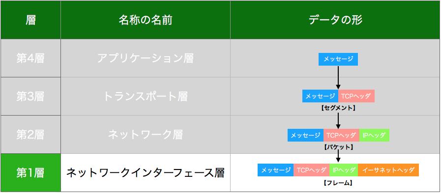
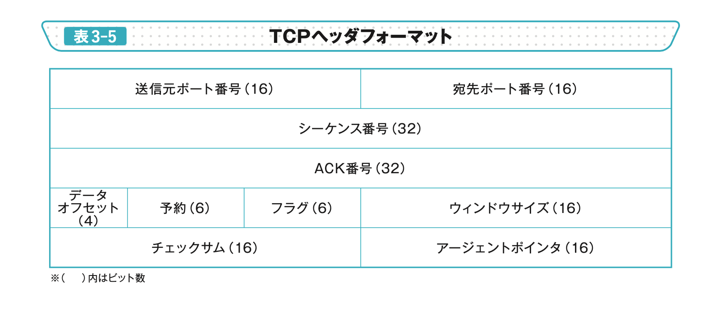
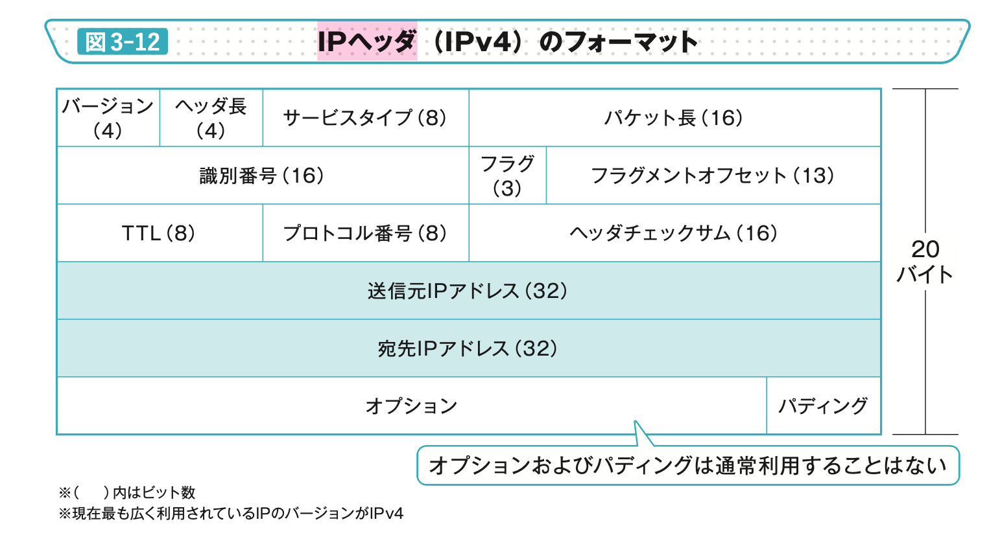
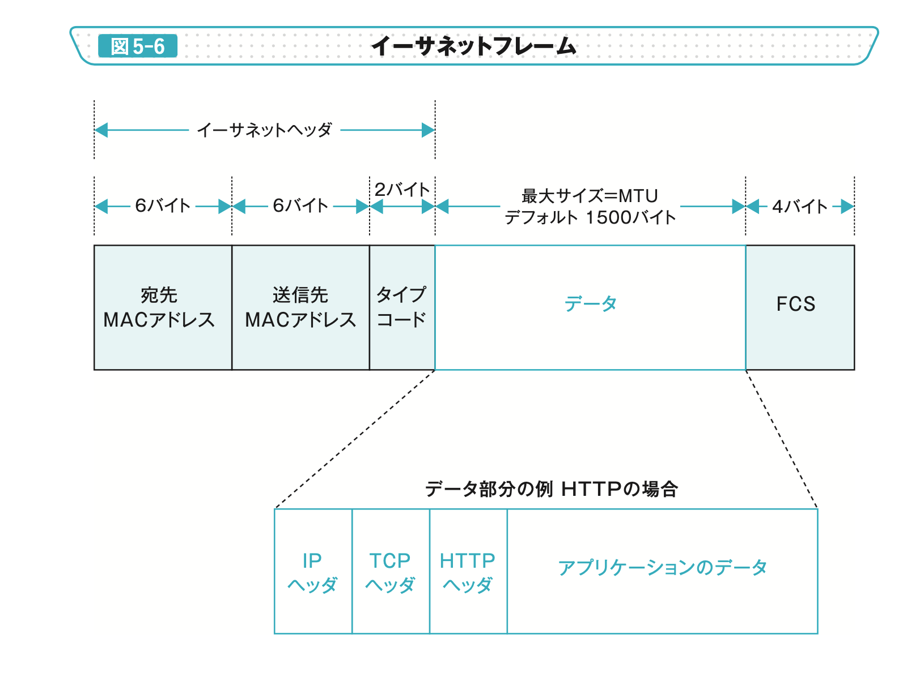
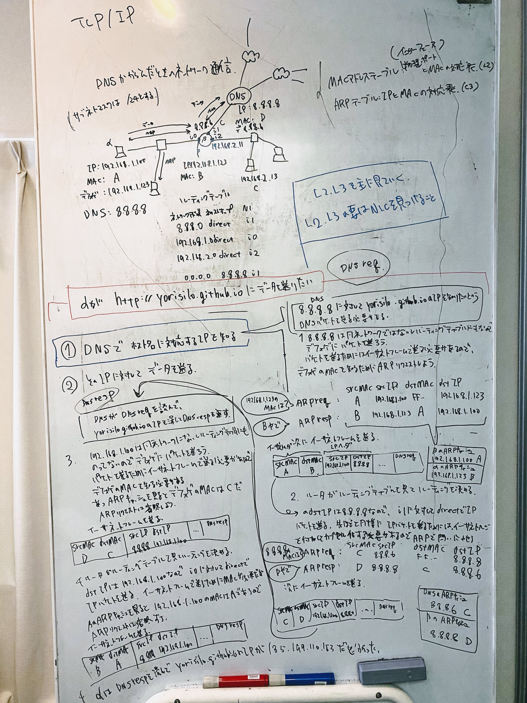
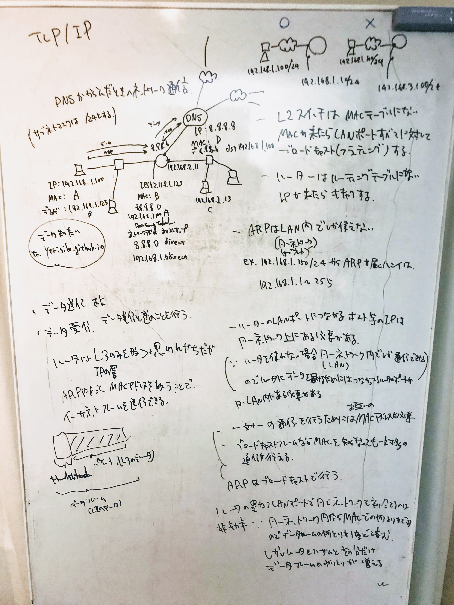

2020-04-18 02:04:05

# NIC を探し当てろ！
- keywords: TCP/IP, layer(application, transport, network, link), ルーティング、L2スイッチ、ルータ、ARP

ここで呼んでる NIC は、イーサネット用のLANポートを備えたカードのみを指しているわけではなく、ネットワークインターフェースを備えたもの(仮想NIC、ネットワークアダプタ、LAN アダプタ、イーサネットアダプタなど)全般を指しています。
つまり、MACアドレスと、IPアドレスが設定されているやつのことを NIC と呼んでいます。

## この発表について
### 書いた人
- ネットワークに詳しくないアプリケーションエンジニア
  - golang でいう net/http とか、使っても net パッケージくらいまでしか降りて使わない。いわゆるソケット通信のところくらいまでは降りることはあっても、それ以下のレイヤーには降りたことはないみたいな感じ。

### 対象者
- ネットワークに詳しくないアプリケーションエンジニア

### ゴール
- TCP/IP の L2(リンク層), L3(ネットワーク層) の役割がざっくりわかる

## ３行+αで説明する
- TCP/IP の各層で何をやってるかをざっくり説明する
- 各層のヘッダのフォーマットを見れば、どの層が何をやってるかがなんとなくわかるので、一度ヘッダのフォーマットを見てみる
- ネットワーク通信は主に、２種類の構成でできている。
  - NIC を見つけること。(リンク層+ネットワーク層) <= 今回はこっちのこと中心に話す。
  - ソケットを通じて行う通信(トランスポート層 + アプリケーション層)
- まずはとにかく ARP

## ざっくり TCP/IP
各層でデータの塊的なやつの名前が決まっているっぽい



```
アプリケーション層(HTTP, SMTP, FTP, (DHCP), (DNS),...) メッセージ
トランスポート層(tcp, udp,...) メッセージ + tcp ヘッダ = セグメント
ネットワーク層(インターネット層)(IP, NAT, (ARP), ...) メッセージ + tcp ヘッダ + ip ヘッダ = パケット
ネットワーク・インターフェース層(リンク層)(イーサネット, Wi-Fi,...) メッセージ + tcp ヘッダ + ip ヘッダ + イーサネットヘッダ = フレーム
```

ざっくり各層を説明する

- アプリケーション層: データを決める
- トランスポート層: ポートを決める
- ネットワーク層: IP を決める
- リンク層: MAC を決める

### cf.
- [インターネット通信の流れ - Qiita](https://qiita.com/naoki_mochizuki/items/7ee0e01db61e1e7abd62) <= 画像はこちらの記事のものを使ってます
- [令和の今だからこそ地球🌏の裏側までパケットを届けるIPを理解する - Qiita](https://qiita.com/zawawahoge/items/f810238daf02ca9042ce#_reference-b2334a9477a97ceb5f64)
- [TCP/IP - TCPとは - TCPヘッダ](https://www.infraexpert.com/study/tcpip8.html)

## ネットワークを流れるデータ

```
イーサネットヘッダ + IPヘッダ + TCPヘッダ + HTTP ヘッダ + メッセージ + FCS
```

## アプリケーション層
- OSI参照モデルだと L7にあたる
  - アプリケーションが実際に読んだり作成したりするデータを扱う
- DNS: アプリケーション層とネットワーク層をつなげる役目。 ホスト名とIPアドレスを紐付けること(名前解決)を行う `FQDN(ホスト名+ドメイン名) -> IP`
  cf. [DNSの仕組みの概要 | ITSakura](https://itsakura.com/network-dns)
- DHCP: NIC に IP アドレスを自動で設定するプロトコル

### メッセージ = HTTP ヘッダー + body
HTTP リクエスト

```
GET / HTTP/1.1 -- リクエスト行
Host: www.google.co.jp -- ヘッダ
User-Agent: curl/7.67.0 -- ヘッダ
Accept: */* -- ヘッダ
-- 空行(ヘッダとメッセージボディを区別するためにこれが必要)
-- メッセージボディ(POSTメソッドなどで使用する)
```

HTTP レスポンス

```
HTTP/1.1 200 OK -- レスポンス行
Connection: close -- ヘッダ
Content-Type: application/json; charset=utf-8 -- ヘッダ
Date: Sun, 05 Jan 2020 15:57:44 GMT -- ヘッダ
Content-Length: 177 -- ヘッダ
-- 空行(ヘッダとメッセージボディを区別するためにこれが必要)
{"msg": "ok"} -- メッセージボディ
```

## トランスポート層
- OSI参照モデルだと L4にあたる
- ポートとポートを紐付けて、どのアプリケーションに対して通信を行うかを決めるところ。

### ヘッダー
TCPヘッダー


## ネットワーク(インターネット)層
- OSI参照モデルだと L3にあたる
- 主に IP を扱い、 ネットワークのルーティングを決める役割を担う
- ARP: ネットワーク層とリンク層をつなげる役目。 IPからMACを紐付けること(アドレス解決)を行う `IP -> MAC`。 ARP は別ネットワーク(ルーター)を超えることはできない。
    > TCP/IPにおける通信では、通信に先立って、ほとんどの場合に必ずこのARPプロトコル・パケットの送受信が行われ、お互いのコンピュータ同士がMACアドレス情報のやりとりを行うことになっている（シリアル回線のように直接相互に接続されているような場合は、通信相手は常に特定されているので、ARPは使われない）。
    https://www.atmarkit.co.jp/ait/articles/0305/09/news003.html
- NAT: ネットワーク層内部で閉じている。グローバルIPとプライベートIPを紐付ける。
- L3スイッチ: レイヤ2スイッチ + ルータの機能を併せ持つ。なので、同じネットワーク内のホストをまとめるのに L2 スイッチを使わないで済む。

```
a(192.168.1.100/24) -->
                        L2 --> ルータ --> WAN
b(192.168.1.4/24)   -->


a(192.168.1.100/24) -->
                        L3 --> WAN
b(192.168.1.4/24)   -->
```

### ヘッダー
IPヘッダー


## リンク(ネットワークインターフェース)層
- OSI参照モデルだと L2にあたる
  - 主に MAC アドレスを扱い、どの NIC や物理ポートに接続するかを決めるところ
- L2スイッチ: dst MAC アドレスですかー？って隣のL2スイッチへ転送していき、MACアドレステーブルを更新していく。
- VLAN: L2 スイッチは本来1つのネットワークを構成するネットワーク機器だが、 VLAN によって、仮想的にL2スイッチ内で複数のネットワークを構成することができるようになる。

### ヘッダー
イーサネットヘッダー


## http 通信を追ってみる(L2,L3を詳しく見る)
keywords

- ARPテーブル(ARPキャッシュ): IP と MAC アドレスの組のテーブル
- MACアドレステーブル: MACアドレスとL2スイッチの物理ポート(インターフェース)の組のテーブル
- ルーティングテーブル: 宛先ネットワークアドレス/サブネットマスク、ネクストホップアドレス、インターフェースの組のテーブル
- デフォルトゲートウェイ: 同一LAN以外の通信時にここに問い合わせる

### 例
- client: `curl http://yorisilo.github.io:80`
- server: http://yorisilo.github.io は port 80 で GET に対して、 HTTP1.1 200 hello を返す

我々が普段意識するのはこんな感じだが、低レイヤでは何が行われているのかを見ていく。
普段あんまり考えないかもしれないが、 アプリケーション層(http)はもちろん、トランスポート層(:80)やネットワーク層(yorisilo.github.io)に必要な要素は URL のところに表出してる。

- ネットワーク通信は主に、２種類の構成でできている。
  - NIC を見つけること。(リンク層+ネットワーク層) <= 今回はこっちのこと中心に話す。
  - ソケットを通じて行う通信(トランスポート層 + アプリケーション層)

実際、我々は意識しないが、 DNS, ARP, ICMP などのサブプロトコルによって、ソケット通信を行う前にNICを見つけるという準備を行っている。
ネットワーク通信(L2,L3)の要は NIC を見つけること。これに尽きると言っても良いだろう。
NIC を見つけたあとで、 ソケット通信を行うのである。

ネットワーク通信を追ってみる


L2, L3 の FAQ


## cf.
- [ネットワーク入門サイト - 全体の通信の流れ](https://beginners-network.com/nagare.html)
- [Lesson4：ルーターだってARPを使う，実際の通信の流れを知ろう | 日経 xTECH（クロステック）](https://tech.nikkeibp.co.jp/it/article/COLUMN/20070926/282842/)
- [ASCII.jp：IPアドレスからMACアドレスを調べるARPはどこまで有効？](https://ascii.jp/elem/000/000/629/629331/)
- [【図解】ルーティングの流れ ～同一セグメント内通信とデフォルトゲートウェイによる別セグメント間通信 | SEの道標](https://milestone-of-se.nesuke.com/nw-basic/grasp-nw/inner-and-inter-segment/)
- [3 Minutes Networking](http://www5e.biglobe.ne.jp/aji/3min/index.html)
- [3 Minutes Networking No.28](http://www5e.biglobe.ne.jp/aji/3min/28.html)

## まとめ
これで、あのアレな人にも馬鹿にされずに済むぞ！

- NIC: ネットワークインターフェースカードのこと。データフレームはこのNICを通じて入ってくる。NICにはMACアドレス、IPアドレスが紐付いている。このNICが電気信号(物理)とビットストリーム(論理)の境界となっている。 L2(リンク層,MACアドレスを扱う層),L3(ネットワーク層,IPを扱う層) では、この NIC を探し当てるのが一番の目的である。
- MAC アドレス: 物理アドレスとも呼ばれる。NICに対して紐付いているアドレス。世界でユニークな値。 TCP/IPのリンク層(L2)で扱う値
- DNS: FQDN(ホスト名+ドメイン名) に対応する IPアドレスを引いてくるプロトコルのこと。 `FQDN(ホスト名+ドメイン名) -> IP`
- IPアドレス: 論理アドレスとも呼ばれる。 TCP/IP(L3)で扱う値。NICに紐付いている。世界でユニークな値とは限らない。プライベートIPアドレスやグローバルIPアドレスがある。
- ARP: IPアドレスに対応するMACアドレスを引いてくるプロトコルのこと。 IPアドレスはLAN内(同一ネットワーク)にブロードキャストされて、対応するMACアドレスがあれば、そのMACアドレスが返ってくる。`IP -> MAC`
- ブロードキャスト: LAN内(同一ネットワーク)に対して、同じデータを流すこと。
- ルーティング: ルーティングテーブルに従ってネットワークアドレスとそれに対応するIPアドレスに向けて、パケットを伝搬させるしくみ。
- ルーティングテーブル: ネットワークアドレスとネクストホップアドレスなどの対応表
- サブネット: 広義の意味では、小さなネットワークのこと。競技の意味ではLAN(同ネットワーク)内のネットワークのこと。 ex. 192.168.3.4/24 というIPに対して、サブネットは、 `192.168.3.1~255` で表されるネットワークのこと
- TCP: トランスポート層のプロトコル。 ポート(アプリケーションを指定して)ソケット通信を行うプロトコル。3wayハンドシェイクをして、ソケット通信経路を保ったりする。
- LAN: ネットワークアドレスで疎通できる範囲のネットワークのこと
- WAN: 複数の LAN で構成される複数の異なるネットワークとつながったネットワークのこと

# cf.
- [図解まるわかり ネットワークのしくみ【PDF版】 ｜ SEshop.com ｜ 翔泳社の通販](https://www.seshop.com/product/detail/22237) <= 画像はこちらの本のものを使ってます
